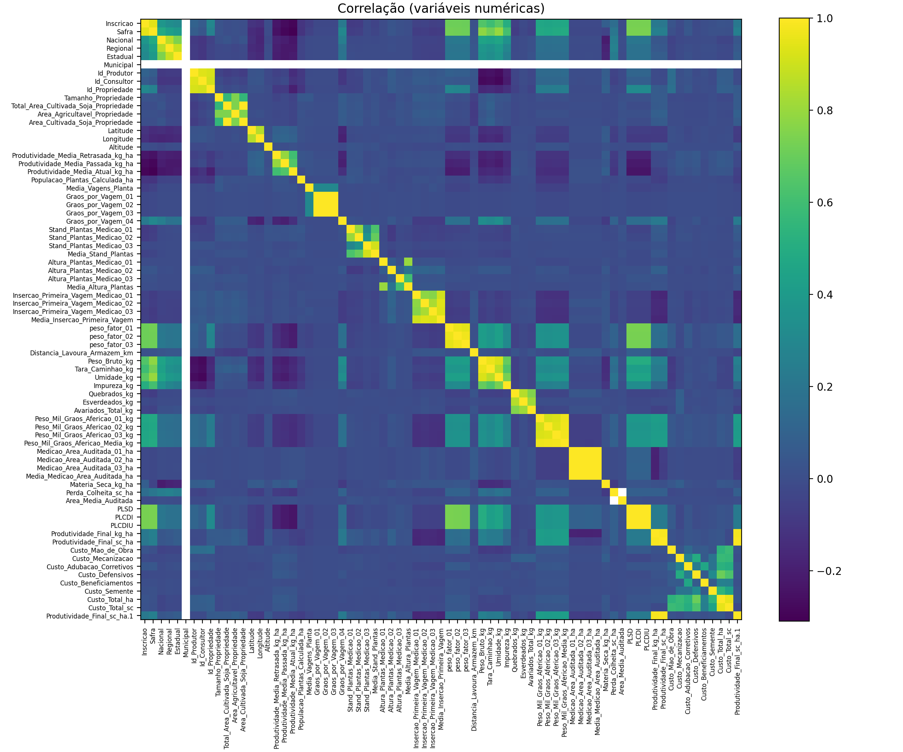
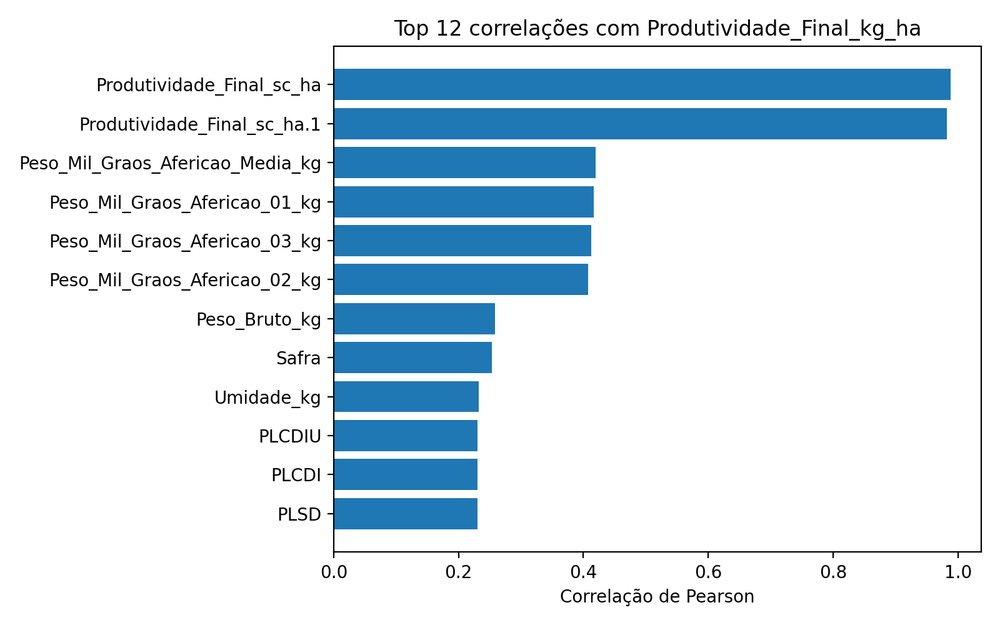
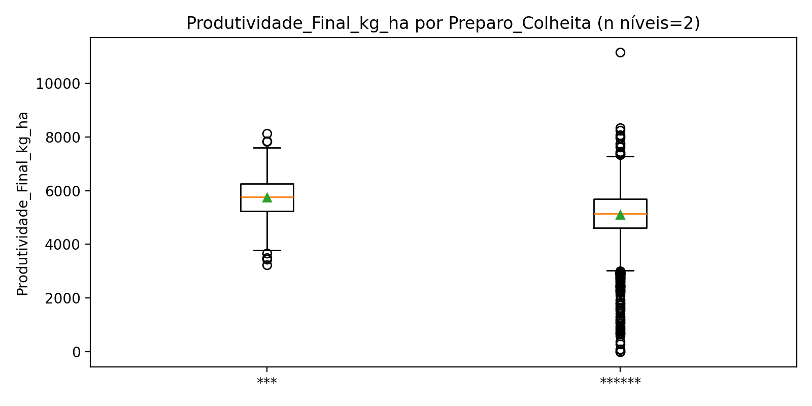
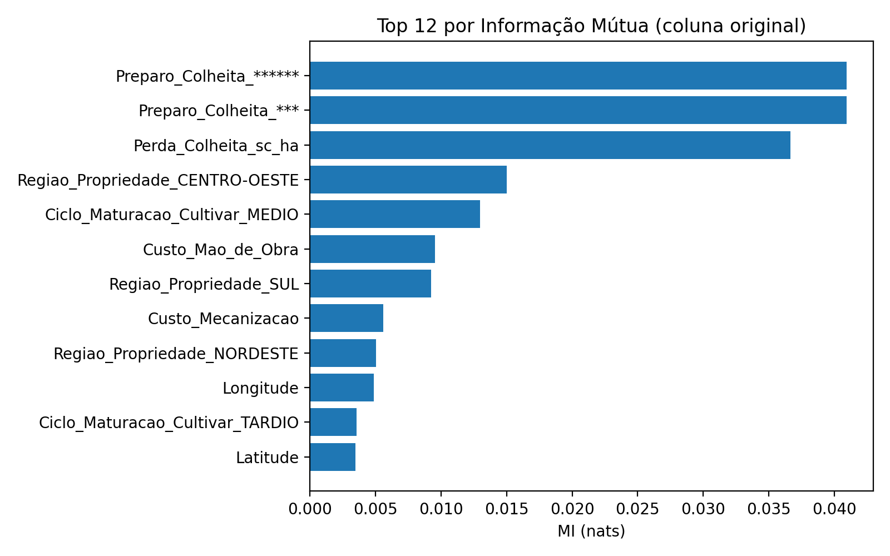
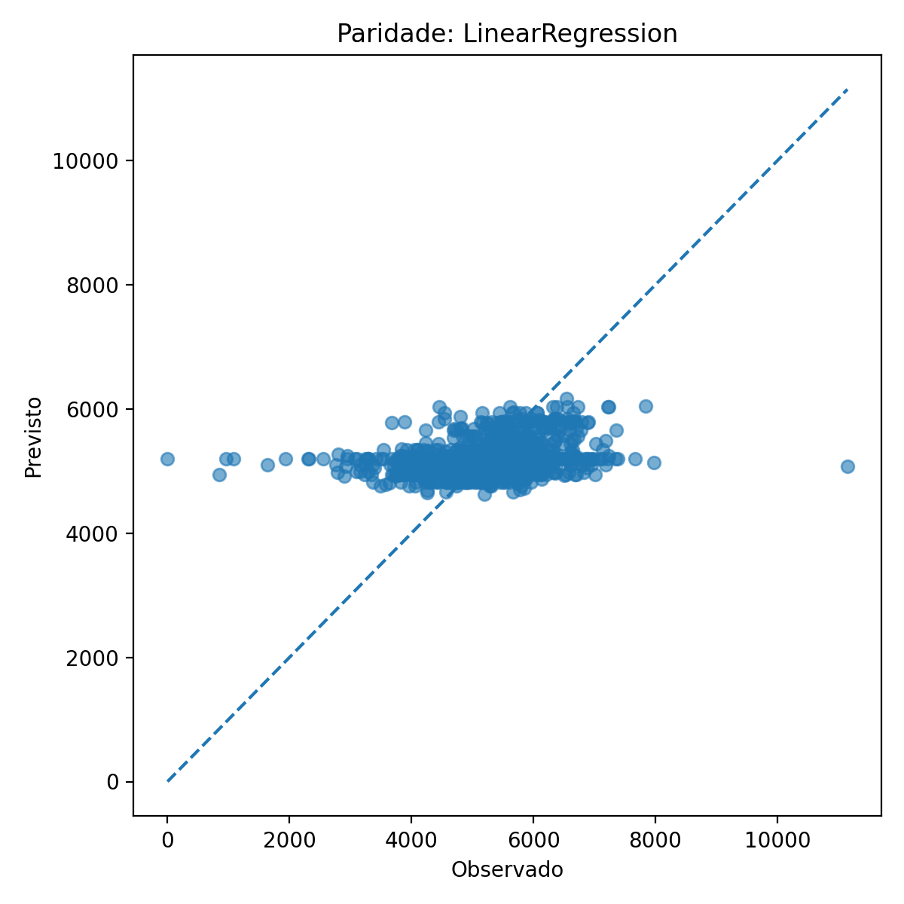
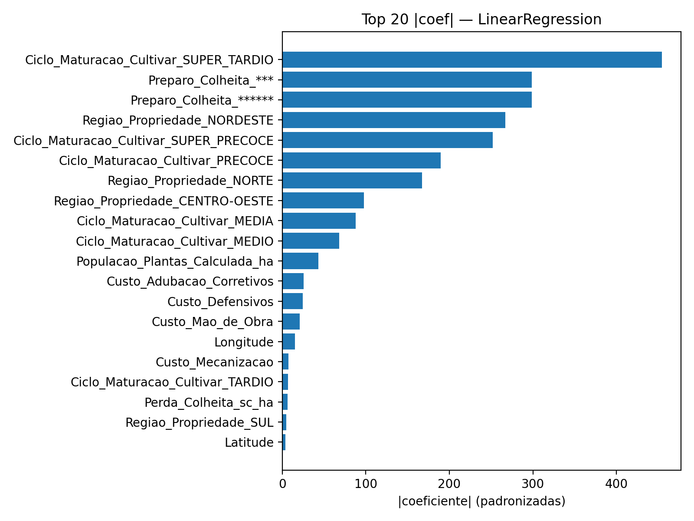

# Modelagem Multivariada — Documentação de Entrega 

> **Grupo 5 — Pipeline Preditivo Integrado (Regressão + Validação)**  
> Repositório estruturado para gerar **análises multivariadas** com foco em **correlações** e **interpretação prática**. Este documento consolida: contexto, estatística descritiva, testes de hipóteses, teoria da informação, modelagem preditiva, validação, resultados e pacote de entrega.

---

## 0) Como rodar (setup rápido)

```bash
# 1) (opcional) criar venv
python -m venv .venv && source .venv/bin/activate  # Windows: .venv\Scripts\activate

# 2) instalar dependências
pip install -r requirements.txt

# 3) rodar o pipeline completo
python -m src.run_all --data data/raw/dados.xlsx --sheet GERAL
```

**Saídas geradas** (para slides/documentação):
- **Tabelas:** `output/tables/*`  
- **Figuras:** `output/figures/*`  
- **Resumo:** `reports/summary.md`

---

## 1) Estrutura do repositório

```
├─ data/
│  └─ raw/
│     └─ dados.xlsx
├─ output/
│  ├─ figures/
│  └─ tables/
├─ reports/
└─ src/
   ├─ __init__.py
   ├─ config.py
   ├─ load_data.py
   ├─ eda.py
   ├─ hypothesis.py
   ├─ info_theory.py
   ├─ select_features.py
   ├─ model.py
   └─ run_all.py
```

- **Reprodutibilidade**: `RANDOM_STATE`, `N_SPLITS` e `requirements.txt`.  
- **Código comentado** (100%) e modular.  
- **Execução única** gera **todas** as evidências usadas nos slides.

---

## 2) Contexto, dados e variáveis (sumário execut.)

- **Problema**: modelar `Produtividade_Final_kg_ha` a partir de variáveis de **custos**, **manejo**, **solo** e **localização**, explicando **correlações** e priorizando **drivers** de impacto.  
- **Dados**: base real CESB (2016–2024).  
- **Target**: `Produtividade_Final_kg_ha`.  
- **Grupos de X**: custos (ex.: `Custo_Adubacao_Corretivos`), manejo (ex.: `Preparo_Colheita`), solo (variáveis físico-químicas) e localização (UF/Região, `Latitude/Longitude`).

> **Entregáveis principais**: tabelas de descritiva e correlação; boxplots/ANOVA; ranking por Informação Mútua; métricas de CV; paridade; ranking de coeficientes; resumo final.

---

## 3) Núcleo comum obrigatório

### 3.1 Estatística descritiva
- **Tabela descritiva (numéricas)**: `output/tables/desc_numericas.csv`  
- **Heatmap de correlação**:  
  
- **Top correlações com o alvo**:  
  Tabela: `output/tables/top_corr_with_target.csv`  
  Gráfico: 
- **Significância** (r, p, n): `output/tables/corr_with_target_pearson_pvalues.csv`

**Leituras sugeridas para o slide**: destaque variáveis com |r| alto e *p* < 0,05, comentando o **sinal** (positivo/negativo) e plausibilidade agronômica.

---

### 3.2 Testes de hipóteses (ex.: fator de manejo)

**Exemplo**: efeito de `Preparo_Colheita` em `Produtividade_Final_kg_ha`.  
- **Visual**: 
- **H0**: médias iguais entre níveis do fator; **H1**: diferença em pelo menos um nível.  
- **Teste**: ANOVA (α=0,05) + **eta²** (tamanho de efeito).  
- **Conclusão**: reportar F, p e interpretação prática (impacto esperado por nível).

> Dica: se houver assimetria severa/outliers, considerar transformação ou teste robusto.

---

### 3.3 Teoria da Informação (relevância de variáveis)

- **Ranking por Informação Mútua (MI)** — agregado por coluna original:  
    
- **Arquivos**:  
  - `output/tables/mutual_information_top.csv` (Top-K por MI)  
  - `output/tables/mutual_information_by_feature.csv` (todas)  

**Leitura**: confronte MI × |r|. Divergências indicam **relações não lineares** ou efeitos combinados.

---

## 4) Técnica multivariada — Pipeline preditivo integrado

### 4.1 Modelagem & Validação
- **Validação cruzada (K-fold)** com métricas **R²**, **RMSE**, **MAE**:  
  `output/tables/model_cv_metrics.csv`  
- **Paridade (hold-out 20%)**:  
  

### 4.2 Interpretação do modelo (coeficientes)
- **Top |coef| (dados padronizados)**:  
    
  `output/tables/coefficients_LinearRegression.csv`

**Narrativa**: integre **coeficientes** (sinal/magnitude), **MI** (relevância) e **correlações** (direção/força) para priorizar 2–3 **drivers acionáveis**.

> **Opcional**: ativar `FAST_MODE=False` em `src/model.py` para comparar **RidgeCV** e **LassoCV** (regularização + busca de α via CV).

---

## 5) Resultados & Discussão (roteiro para slide)

1. **Panorama** (descritiva + corr_heatmap): clusters/colinearidade.  
2. **Relações com o alvo** (top_corr + p-valores): variáveis mais alinhadas.  
3. **Evidência visual** (dispersões e boxplots): reforço de causalidade plausível.  
4. **MI**: variáveis relevantes mesmo sem linearidade forte.  
5. **Modelo + CV**: qualidade média e estabilidade (±dp); **paridade** para viés/tendência.  
6. **Interpretação**: `coef_top_abs_LinearRegression.png` → drivers.  
7. **Recomendação**: 2–3 ações mensuráveis (manejo/custo/região).

---

## 6) Apêndice — fórmulas & conceitos 

### 6.1 Formulas
- **Média:**
\[
\bar{x} = \frac{\sum_{i=1}^{n} x_i}{n}
\]

- **Variância:**
\[
s^2 = \frac{\sum_{i=1}^{n}(x_i - \bar{x})^2}{n-1}
\]

- **Coeficiente de correlação de Pearson:**
\[
r_{xy} = \frac{\sum_{i=1}^{n}(x_i - \bar{x})(y_i - \bar{y})}{\sqrt{\sum (x_i - \bar{x})^2 \sum (y_i - \bar{y})^2}}
\]

### 6.2 Testes de Hipóteses

O rigor estatístico exige a validação de suposições. Consideramos, por exemplo, a hipótese de que o **tipo de fertilização** influencia a produtividade.

#### 6.2.1 Formulação

* Hipótese nula:

$$
H_0: \mu_A = \mu_B = \mu_C
$$

(As médias de produtividade dos três grupos de fertilização são iguais).

* Hipótese alternativa:

$$
H_1: \exists \, i,j \mid \mu_i \neq \mu_j
$$

#### 6.2.2 Teste ANOVA

A estatística do teste é dada por:

$$
F = \frac{MS_{\text{between}}}{MS_{\text{within}}}
$$

onde $MS = \frac{SQ}{gl}$.

### 6.3 Teoria da Informação

A teoria da informação pode auxiliar na seleção de variáveis relevantes para o modelo.

#### 6.3.1 Fórmulas

* **Entropia de Shannon:**

$$
H(X) = - \sum_{i=1}^{n} p(x_i) \log_2 p(x_i)
$$

* **Informação Mútua:**

$$
I(X;Y) = \sum_{x,y} p(x,y) \log \frac{p(x,y)}{p(x)p(y)}
$$

### 6.3 Modelos Preditivos Integrados

#### 6.3.1 Regressão Linear Múltipla

O modelo geral é dado por:

$$
y = \beta_0 + \beta_1 x_1 + \beta_2 x_2 + \dots + \beta_p x_p + \epsilon
$$

onde:

* $y$ é a produtividade;
* $x_i$ são as variáveis independentes (clima, solo, fertilização, manejo);
* $\beta_i$ são os coeficientes estimados.

#### 6.3.2 Regularização (Lasso e Ridge)

* **Ridge:** adiciona penalização $L_2$:

$$
\min \| y - X\beta \|^2 + \lambda \sum \beta_i^2
$$

* **Lasso:** adiciona penalização $L_1$:

$$
\min \| y - X\beta \|^2 + \lambda \sum |\beta_i|
$$

#### 6.3.3 Validação Cruzada

A técnica de **k-fold cross-validation** divide os dados em k partes, treinando em k-1 e testando na parte restante, repetindo o processo k vezes. Isso assegura maior robustez na avaliação do modelo.


## 7) Artefatos incluídos (10 evidências principais, entre outras)

**Figuras**  
1. `output/figures/corr_heatmap.png`  
2. `output/figures/top_corr_with_target_bar.png`  
3. `output/figures/mi_top_features_bar.png`  
4. `output/figures/paridade_LinearRegression.png`  
5. `output/figures/coef_top_abs_LinearRegression.png`  
6. `output/figures/box_Produtividade_Final_kg_ha_by_Preparo_Colheita.png`  

**Tabelas**  
7. `output/tables/desc_numericas.csv`  
8. `output/tables/top_corr_with_target.csv`  
9. `output/tables/corr_with_target_pearson_pvalues.csv`  
10. `output/tables/model_cv_metrics.csv`

